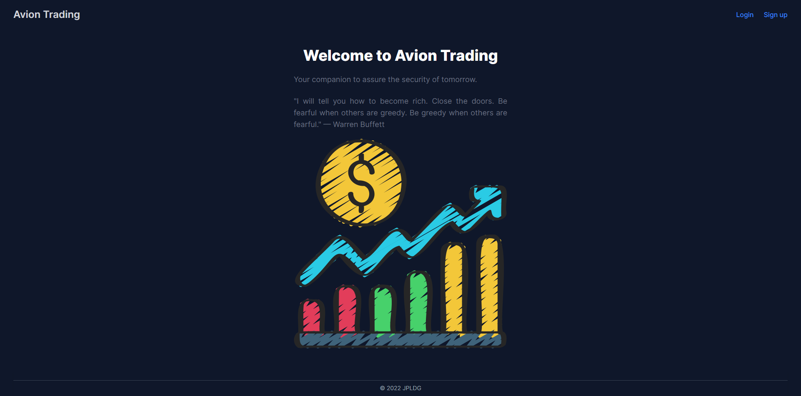
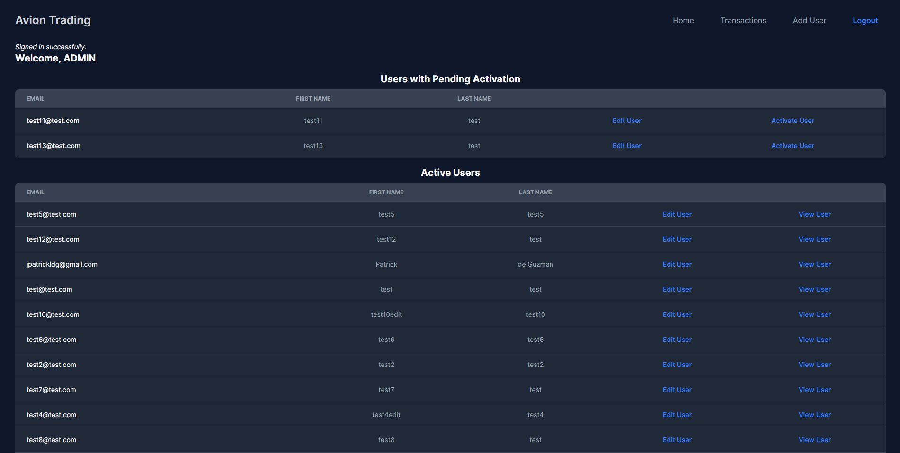
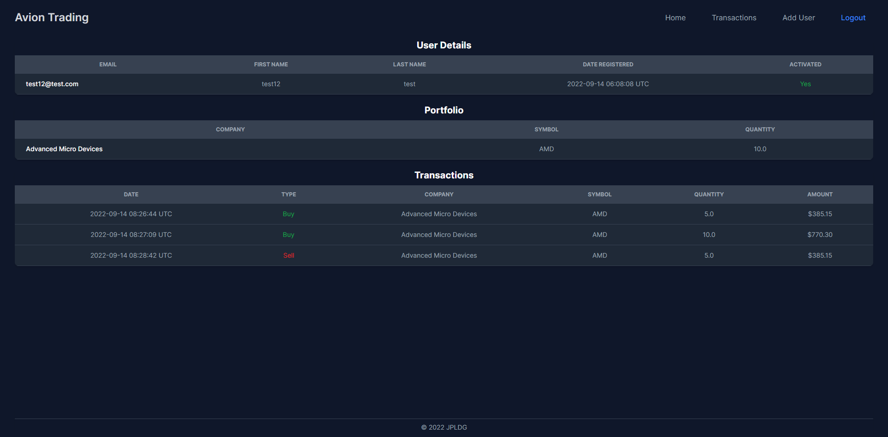
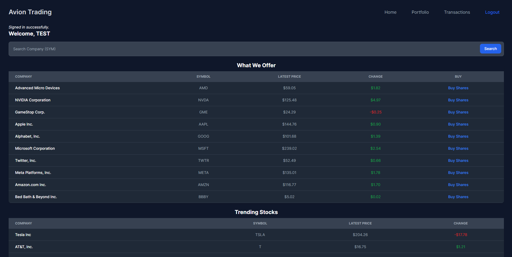
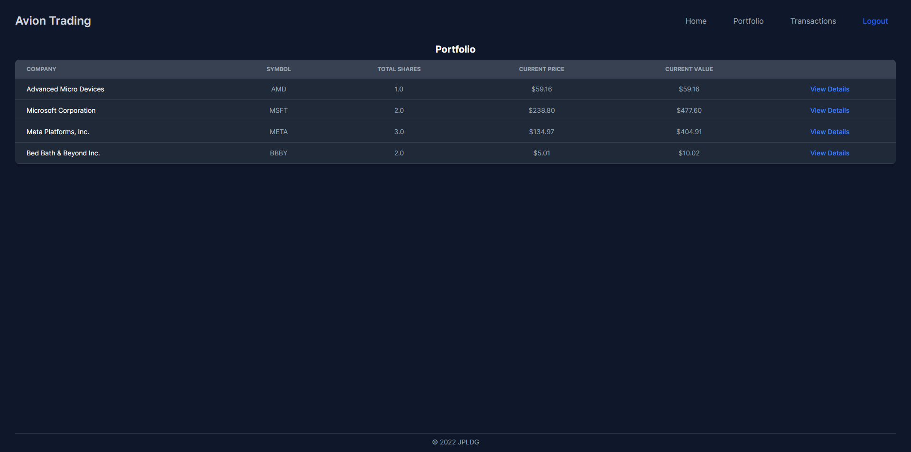
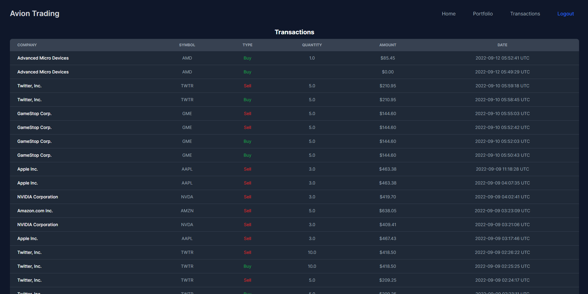
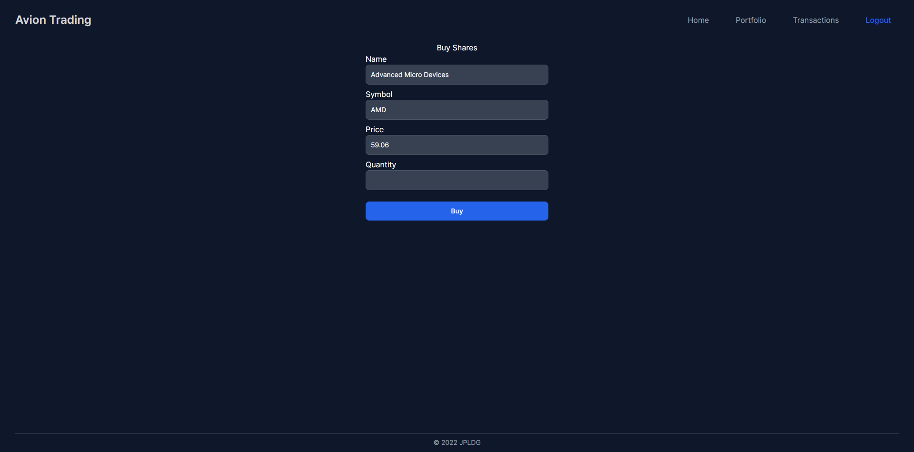
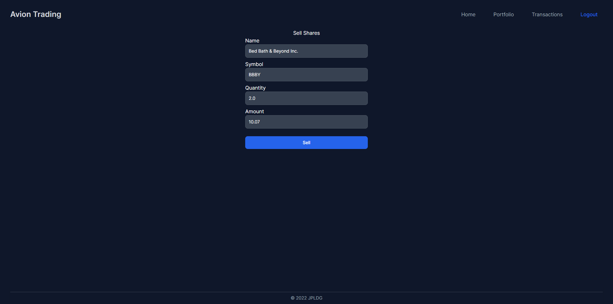

# Stock Trading App

A stock trading app where users can register as traders to buy and sell shares of a company. Click [here](https://avion-trading-app.herokuapp.com/) to view the app on Heroku. :smile:

#### Test Accounts (Password: `123456`)
- Admin: `admin@test.com`
- Trader: `trader@test.com`


### Homepage


### Admin Pages



### Trader Pages






## Built With

- [Ruby on Rails](https://rubyonrails.org/)
- [PostgreSQL](https://www.postgresql.org/)
- [TailwindCSS](https://tailwindcss.com/)

## Version
```
* Ruby 3.1.2
* Rails 7.0.4
```

## Setup
```
 $ bundle install
 $ rails db:setup
```
 
## Starting the application
```
 $ rails server
```
